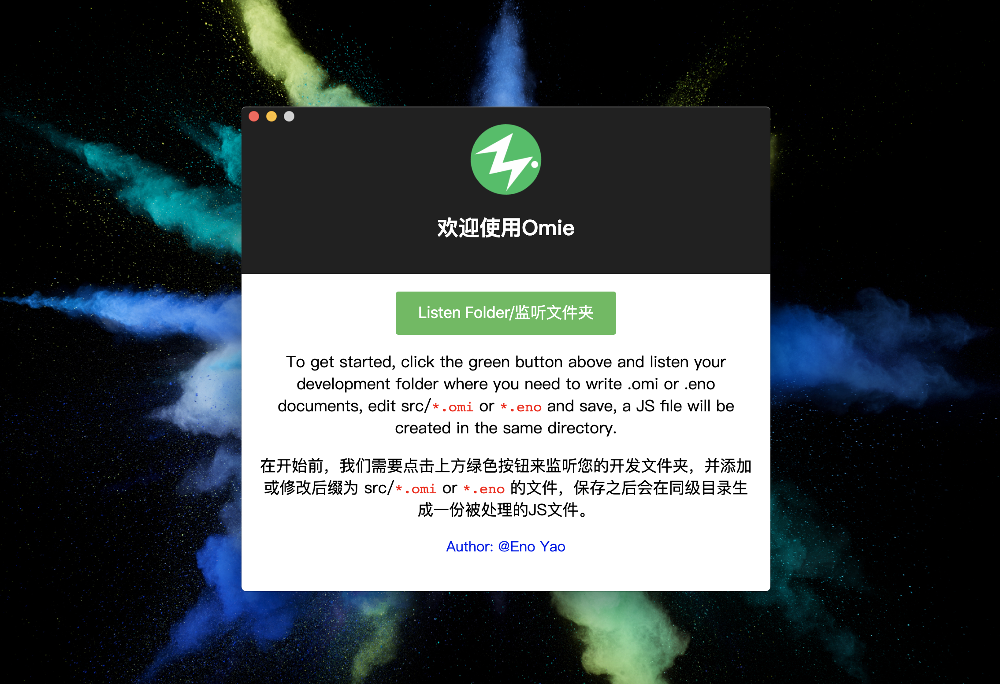

<div align="center">
<p></p>

<h1>Omi electron</h1>

<p>
  <strong>Build cross platform desktop apps with Omi.js and Electron.js</strong>
  <br /><br />
  <strong>基于Omi.js和Electron.js构建跨平台的桌面应用</strong>,
  <a href="https://github.com/Wscats/omi-electron/releases/tag/1.3">Download Win Version Zip</a>
  or
  <a href="https://github.com/Wscats/omi-electron/releases/tag/1.2">Download Mac Version Zip</a>
</p>

<p>
  <sub>Made with ❤︎ by
    <a href="https://github.com/Wscats">Eno Yao</a>
  </sub>
</p>

<p>
<a href="https://github.com/Wscats/news"></a>
<a href="https://github.com/Wscats/news"></a>
<a href="https://github.com/Wscats/news"></a>
<a href="https://github.com/Wscats/news"></a>
</p>

</div>

# To Use

最新版本下载: [Win版本](https://pan.baidu.com/s/1n6fko0ZXl5E6X2nK5Xe6SA)

最新版本下载: [Mac版本](https://pan.baidu.com/s/1eCZlzi9eAhDriECclAzfoQ)

The latest stable download: [Win Version](https://pan.baidu.com/s/1n6fko0ZXl5E6X2nK5Xe6SA)

The latest stable download: [Mac Version](https://pan.baidu.com/s/1eCZlzi9eAhDriECclAzfoQ)

将下载的压缩文件解压并并安装到系统中，双击应用图标启动应用，点击应用中间的绿色按钮，指定您的Omi项目的开发目录(一般是`src`文件夹下)，切换到你的编辑工具并在您项目的开发目录下创建或者编辑`.omi`后缀的文件，该文件会自动编译为`.js`文件

Unzip the downloaded compressed file and install it into the system. Double-click the application icon to start the application, click the green button in the middle of the application, select the development directory of your Omi project (usually under the `src` folder), switch to your IDE, and create or edit the file with the suffix of `.omi` under the development directory of your project. The file will be automatically compiled into `.js` file.



# About Electron
**Clone and run for a quick way to see Electron in action.**

This is a minimal Electron application based on the [Quick Start Guide](https://electronjs.org/docs/tutorial/quick-start) within the Electron documentation.

**Use this app along with the [Electron API Demos](https://electronjs.org/#get-started) app for API code examples to help you get started.**

A basic Electron application needs just these files:

- `package.json` - Points to the app's main file and lists its details and dependencies.
- `main.js` - Starts the app and creates a browser window to render HTML. This is the app's **main process**.
- `index.html` - A web page to render. This is the app's **renderer process**.

You can learn more about each of these components within the [Quick Start Guide](https://electronjs.org/docs/tutorial/quick-start).


# To Develop

## 1. The first method:
```bash
# Install this module from npm
npm install omie
# Go into the repository
cd node_modules/omie
# Install dependencies
npm install
# Run the app
npm start
```

## 2. The second method:

To clone and run this repository you'll need [Git](https://git-scm.com) and [Node.js](https://nodejs.org/en/download/) (which comes with [npm](http://npmjs.com)) installed on your computer. From your command line:

```bash
# Clone this repository
git clone https://github.com/Wscats/omi-electron
# Go into the repository
cd omi-electron
# Install dependencies
npm install
# Run the app
npm start
```

Note: If you're using Linux Bash for Windows, [see this guide](https://www.howtogeek.com/261575/how-to-run-graphical-linux-desktop-applications-from-windows-10s-bash-shell/) or use `node` from the command prompt.

# Resources for Learning Electron

- [electronjs.org/docs](https://electronjs.org/docs) - all of Electron's documentation
- [electronjs.org/community#boilerplates](https://electronjs.org/community#boilerplates) - sample starter apps created by the community
- [electron/electron-quick-start](https://github.com/electron/electron-quick-start) - a very basic starter Electron app
- [electron/simple-samples](https://github.com/electron/simple-samples) - small applications with ideas for taking them further
- [electron/electron-api-demos](https://github.com/electron/electron-api-demos) - an Electron app that teaches you how to use Electron
- [hokein/electron-sample-apps](https://github.com/hokein/electron-sample-apps) - small demo apps for the various Electron APIs

# License

[MIT (Public Domain)](LICENSE.md)
